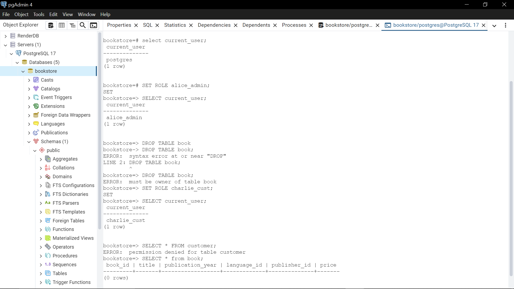
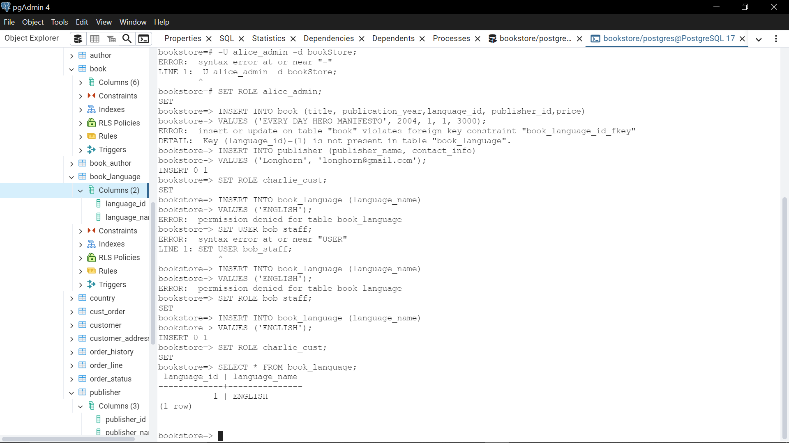

# 📚 Bookstore Database Project – PostgreSQL

This project implements a bookstore database system using **PostgreSQL**. It covers complete database design, role-based access control, and testing of permissions.

---

## 🚀 Features

- Fully normalized relational database schema for a bookstore
- Clear definition of entities and relationships
- Support for multiple authors per book
- Tracking of orders and shipping methods
- Country-based address resolution
- Strong access control using PostgreSQL roles

---

## 🗂️ Schema Overview

### 🏷️ Core Tables
- **book** – List of all books in the store
- **author** – List of all authors
- **book_author** – Many-to-many relationship between books and authors
- **book_language** – Language options for books
- **publisher** – Book publishers
- **customer** – Bookstore customers
- **cust_order** – Orders placed by customers
- **order_line** – Books included in each order
- **order_history** – Status history of orders
- **order_status** – Possible states of an order (pending, shipped, delivered)

### 🏠 Address Management
- **address** – Physical address entries
- **customer_address** – Maps customers to addresses
- **address_status** – Label for current vs old addresses
- **country** – Supported countries

### 🚚 Shipping
- **shipping_method** – Available shipping options

---

## 🛡️ Access Control (Roles & Permissions)

### ✅ Roles Created

- **`programmer`**
  - Full control (SUPERUSER, CREATEROLE, CREATEDB)
  - For trusted developers

- **`admin`**
  - Can read/write most data
  - Cannot create new roles or databases

- **`staff`**
  - Can manage operational tables (books, authors, orders, customers)
  - Cannot delete or access restricted records

- **`customer_user`**
  - Can browse books and shipping methods
  - Can create and view their own orders
  - Cannot view all customers’ data (restricted via REVOKE)

### 👤 Users Assigned

- `alice_admin` → `admin`
- `bob_staff` → `staff`
- `charlie_cust` → `customer_user`

---

## 🧪 Role Testing

To test roles, either log in with each user:

- charlie_cust is a customer.
- Customers can't delete a table or anything else in the database.

- The user is set to alice_admin who is an admin. This user can insert data into any table.
- The operation fails first because there are some foreign tables that need to be filled in inorder to reference the foregn key.
- The user is then set to charlie_cust who is a customer.
- Customers have a select number of tables that they can Insert data into

## Possible Scaling areas
- The user roles can be linked to the users table to ensure smooth operation in a working system.

## Credits
Fabian Ndung'u 😎
Database Administator

